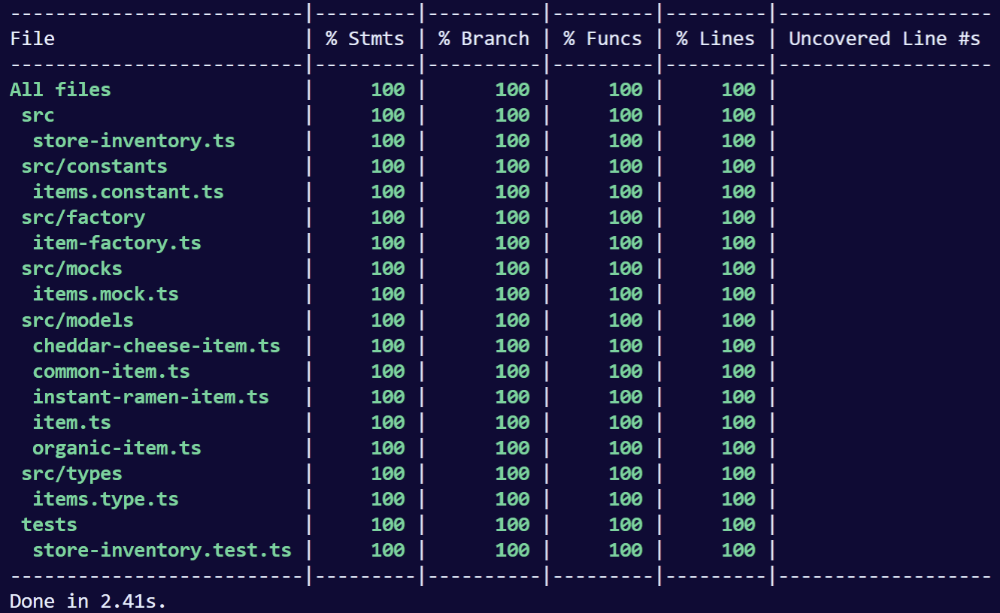

## Replicant Grocery Inventory Requirements Specification

  Hi and welcome to team `Replicant`. As you know, we have extended our platform functionality to include 
  grocery inventory management. We also buy and sell only the finest goods. Unfortunately, our goods 
  are constantly degrading in quality as they approach their sell by date. We have a system in place 
  on self-service work. Your task is to add the new feature to our system so that we can begin selling 
  a new category of items. First an introduction to our system:

    - All items have a SellIn value which denotes the number of days we have to sell the item
    - All items have a Quality value which denotes how valuable the item is
    - At the end of each day our system lowers both values for every item

  Pretty simple, right? Well this is where it gets interesting:

    - Once the sellIn date has passed, Quality degrades twice as fast
    - The Quality of an item is never negative
    - The Quality of an item is never more than 25
    - "Cheddar Cheese" actually increases in Quality the older it gets
    - "Instant Ramen", never has to be sold or decreases in Quality

  We have recently signed a supplier of organic items. This requires an update to our system:

    - "Organic" items degrade in Quality twice as fast as normal items
    - Once ANY item is 5 days past its sellIn date we can no longer sell it and it should be removed from our system
  
  Your objectives for this challenge: 

    - We are looking to see how your technical approach considers these two themes:
      - Adding functionality that aligns with the spec posted above 
      - Improving old/ugly code to be be more readable, maintainable and testable
    - Unit testing is important to us so we have included Chai for test writing (https://www.chaijs.com/api/bdd/)
    - You don't have to know everything! Feel free to use Google. 
    - We're not interested in how fast you can code. Take as much time as you need to ensure your submission 
      reflects your best work.
    - If you find you're out of time, please note anything you wanted to do and how you would have done it.
      Please be as descriptive as possible.

  ### Steps

    1. Install dependencies using
    `yarn install`
    2. For testings and code coverage
    `yarn test`

